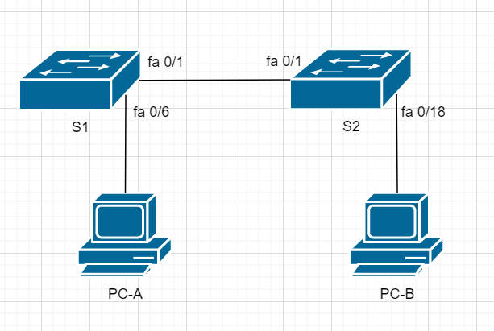
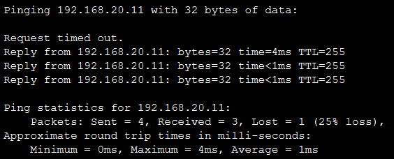

# Домашнее задание №1
## Часть 1. Применение Vlan и Trunking (3.6.2 lab)
### Задачи:
1. Построить сеть и настроить базовую конфигурацию на устройствах
2. Создать vlan и "привязать" прорты на коммутаторах
3. Настроить 802.1Q Trunk между коммутаторами
### Решение:

1. Построим сеть согласно методичке cisco и приведём базовую настройку устройств
Схема сети выглядит следующим образом:


Проведём базовую настройку на устройствах (пример на S1):
```
hostname S1 // Настройка имени устройства
no ip domain-lookup // Настройка отмены поиска DNS
enable secret class // Настройка зашифрованного пароля для входа в привелегированный режим EXEC
line console 0 // Настройка пароля и входа для консольного подключения
 password cisco
 login
line vty 0 15 // Настройка пароля и входа для удалённого подключения
 password cisco
 login
service password-encryption // Настройка "шифрования" открытых паролей
banner motd *!You picked the wrong device, fool!* // Настройка баннера, отображющегося при попытке аутентификации на устройстве
do write // Сохранение текущей конфигурации устройства
```
Базовая настройка на S2 аналогична (кроме имени хоста)

2. Создадим vlan на коммутаторах, назначим ip адреса и "привяжем" интерфейсы к vlan
Создадим vlan  на коммутаторе S1 и "привяжем" их интерфейсам, согласно заданию:
```
vlan 10
 name Management
vlan 20
 name Sales
vlan 30
 name Operations
vlan 999
 name ParkingLot
vlan 1000
 name Native
// Настройка интерфейсов (назначение ip адресов и "привязка" к vlan)
!
interface FastEthernet0/2
 switchport access vlan 999
 switchport mode access // Зададим режим работы порта для vlan
 shutdown
!
interface FastEthernet0/3
 switchport access vlan 999
 switchport mode access
 shutdown
!
interface FastEthernet0/4
 switchport access vlan 999
 switchport mode access
 shutdown
!
interface FastEthernet0/5
 switchport access vlan 999
 switchport mode access
 shutdown
!
interface FastEthernet0/6
 switchport access vlan 20
 switchport mode access
!
interface FastEthernet0/7
 switchport access vlan 999
 switchport mode access
 shutdown
!
interface FastEthernet0/8
 switchport access vlan 999
 switchport mode access
 shutdown
!
interface FastEthernet0/9
 switchport access vlan 999
 switchport mode access
 shutdown
!
interface FastEthernet0/10
 switchport access vlan 999
 switchport mode access
 shutdown
!
interface FastEthernet0/11
 switchport access vlan 999
 switchport mode access
 shutdown
!
interface FastEthernet0/12
 switchport access vlan 999
 switchport mode access
 shutdown
!
interface FastEthernet0/13
 switchport access vlan 999
 switchport mode access
 shutdown
!
interface FastEthernet0/14
 switchport access vlan 999
 switchport mode access
 shutdown
!
interface FastEthernet0/15
 switchport access vlan 999
 switchport mode access
 shutdown
!
interface FastEthernet0/16
 switchport access vlan 999
 switchport mode access
 shutdown
!
interface FastEthernet0/17
 switchport access vlan 999
 switchport mode access
 shutdown
!
interface FastEthernet0/18
 switchport access vlan 999
 switchport mode access
 shutdown
!
interface FastEthernet0/19
 switchport access vlan 999
 switchport mode access
 shutdown
!
interface FastEthernet0/20
 switchport access vlan 999
 switchport mode access
 shutdown
!
interface FastEthernet0/21
 switchport access vlan 999
 switchport mode access
 shutdown
!
interface FastEthernet0/22
 switchport access vlan 999
 switchport mode access
 shutdown
!
interface FastEthernet0/23
 switchport access vlan 999
 switchport mode access
 shutdown
!
interface FastEthernet0/24
 switchport access vlan 999
 switchport mode access
 shutdown
!
interface GigabitEthernet0/1
 switchport access vlan 999
 switchport mode access
 shutdown
!
interface GigabitEthernet0/2
 switchport access vlan 999
 switchport mode access
 shutdown
!
interface Vlan1
 no ip address
 shutdown
!
interface Vlan10
 mac-address 0090.2be8.d501
 ip address 192.168.10.11 255.255.255.0
!
interface Vlan20
 mac-address 0090.2be8.d502
 ip address 192.168.20.11 255.255.255.0
!
interface Vlan30
 mac-address 0090.2be8.d503
 ip address 192.168.30.11 255.255.255.0
!
interface Vlan1000
 mac-address 0090.2be8.d504
 no ip address
!
```
Настройка S2 не сильно отличается. Отличия заключаются только в отличии ip-адреса коммутатора (vlan 10)  и привязке интерфейсов к портам (F0/18)

3. Настройка 802.1Q Trunk между коммутаторами
Настройка будет производиться на интерфейсах, соединяющих коммутаторы между собой.
```
!
interface FastEthernet0/1
 switchport trunk native vlan 1000 // Зададим Native vlan
 switchport trunk allowed vlan 10,20,30,1000 // Опишем какие vlan могут проходить через trunk
 switchport mode trunk // Зададим режим работы порта для vlan
!
```
4. Проверим доступность ресурсов:
PC-A -> S1 (VLAN 20)



PC-B -> S2 
Недоступен, так как не настроена маршрутизация между сетями

## Часть 2. Настройка маршрутизации между vlan  с применением топологии Router-on-a-Stick (4.2.8 lab)
### Задачи:
1. Построить сеть и настроить базовую конфигурацию на устройствах
2. Создать vlan и "привязать" прорты на коммутаторах
3. Настроить 802.1Q Trunk между коммутаторами
4. Настроить маршрутизацию между vlan с применением топологии Router-on-a-Stick
5. Проверить правильность настройки сети
### Решение:
1. Построим сеть согласно методичке cisco и приведём базовую настройку устройств
Схема сети выглядит следующим образом:

Проведём базовую настройку на устройствах (пример на S1):
```
hostname S1 // Настройка имени устройства
no ip domain-lookup // Настройка отмены поиска DNS
enable secret class // Настройка зашифрованного пароля для входа в привелегированный режим EXEC
line console 0 // Настройка пароля и входа для консольного подключения
 password cisco
 login
line vty 0 15 // Настройка пароля и входа для удалённого подключения
 password cisco
 login
service password-encryption // Настройка "шифрования" открытых паролей
banner motd *!You picked the wrong device, fool!* // Настройка баннера, отображющегося при попытке аутентификации на устройстве
do write // Сохранение текущей конфигурации устройства
```
Базовая настройка на S2 аналогична (кроме имени хоста)

2. Создадим vlan на коммутаторах, назначим ip адреса и "привяжем" интерфейсы к vlan
Создадим vlan  на коммутаторе S1 и "привяжем" их интерфейсам, согласно заданию:
```
vlan 3
 name Management
vlan 4
 name Operations
vlan 7
 name ParkingLot
vlan 8
 name Native
// Настройка интерфейсов (назначение ip адресов и "привязка" к vlan)
interface FastEthernet0/1
 switchport access vlan 7
 switchport mode access
 shutdown
!
interface FastEthernet0/2
 switchport access vlan 7
 switchport mode access
 shutdown
!
interface FastEthernet0/4
 switchport access vlan 7
 switchport mode access
 shutdown
!
interface FastEthernet0/6
 switchport access vlan 7
 switchport mode access
 shutdown 
!
interface FastEthernet0/7
 switchport access vlan 7
 switchport mode access
 shutdown
!
interface FastEthernet0/8
 switchport access vlan 7
 switchport mode access
 shutdown
!
interface FastEthernet0/9
 switchport access vlan 7
 switchport mode access
 shutdown
!
interface FastEthernet0/10
 switchport access vlan 7
 switchport mode access
 shutdown
!
interface FastEthernet0/11
 switchport access vlan 7
 switchport mode access
 shutdown
!
interface FastEthernet0/12
 switchport access vlan 7
 switchport mode access
 shutdown
!
interface FastEthernet0/13
 switchport access vlan 7
 switchport mode access
 shutdown
!
interface FastEthernet0/14
 switchport access vlan 7
 switchport mode access
 shutdown
!
interface FastEthernet0/15
 switchport access vlan 3
 switchport mode access
!
interface FastEthernet0/16
 switchport access vlan 7
 switchport mode access
 shutdown
!
interface FastEthernet0/17
 switchport access vlan 7
 switchport mode access
 shutdown
!
interface FastEthernet0/18
 switchport access vlan 7
 switchport mode access
 shutdown
!
interface FastEthernet0/19
 switchport access vlan 7
 switchport mode access
 shutdown
!
interface FastEthernet0/20
 switchport access vlan 7
 switchport mode access
 shutdown 
!
interface FastEthernet0/21
 switchport access vlan 7
 switchport mode access
 shutdown
!
interface FastEthernet0/22
 switchport access vlan 7
 switchport mode access
 shutdown
!
interface FastEthernet0/23
 switchport access vlan 7
 switchport mode access
 shutdown
!
interface FastEthernet0/24
 switchport access vlan 7
 switchport mode access
 shutdown
!
interface GigabitEthernet0/1
 switchport access vlan 7
 switchport mode access
 shutdown
!
interface GigabitEthernet0/2
 switchport access vlan 7
 switchport mode access
 shutdown
!
interface Vlan1
 no ip address
!
interface Vlan3
 ip address 192.168.3.11 255.255.255.0
!
```
Настройка S2 не сильно отличается. Отличия заключаются только в отличии ip-адреса коммутатора (vlan 3).

3. Настройка 802.1Q Trunk между коммутаторами
Настройка будет производиться на интерфейсах, соединяющих коммутаторы между собой.
```
!
interface FastEthernet0/3
 switchport trunk native vlan 8
 switchport trunk allowed vlan 3,4,8
 switchport mode trunk
!
interface FastEthernet0/5
 switchport trunk native vlan 8
 switchport trunk allowed vlan 3,4,8
 switchport mode trunk
!
```
